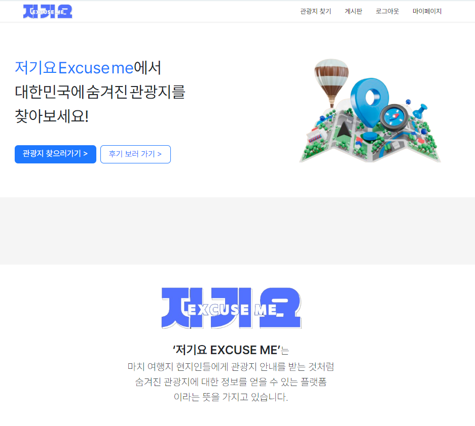
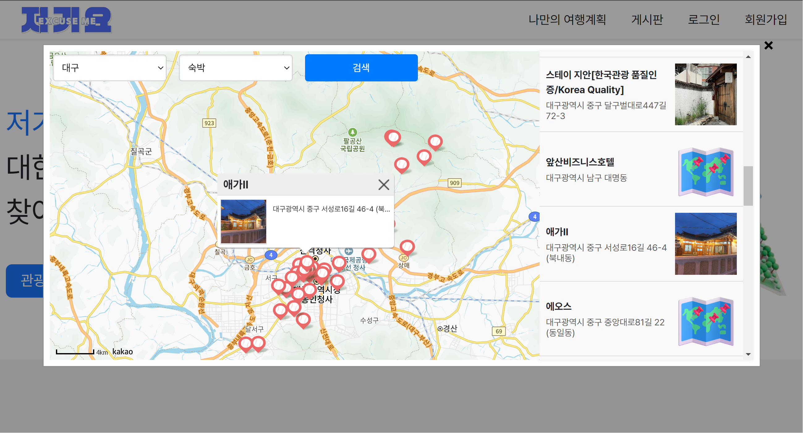
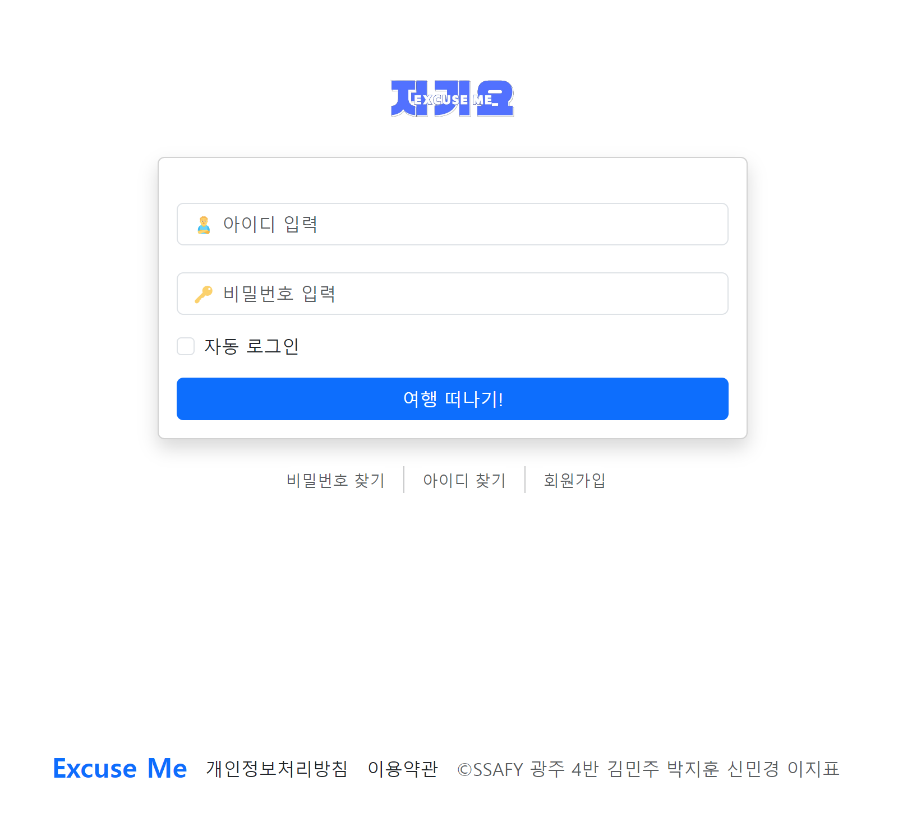
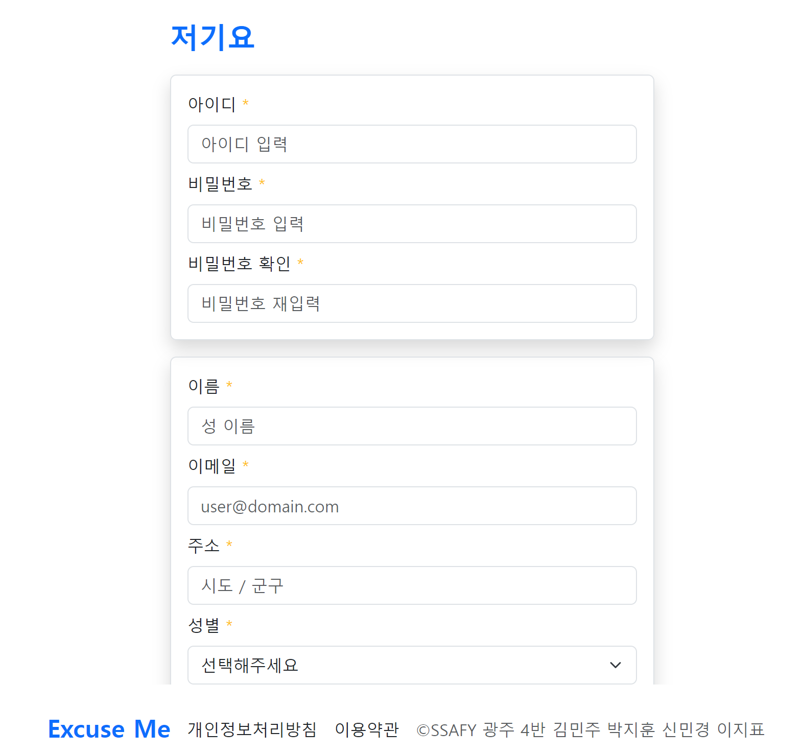
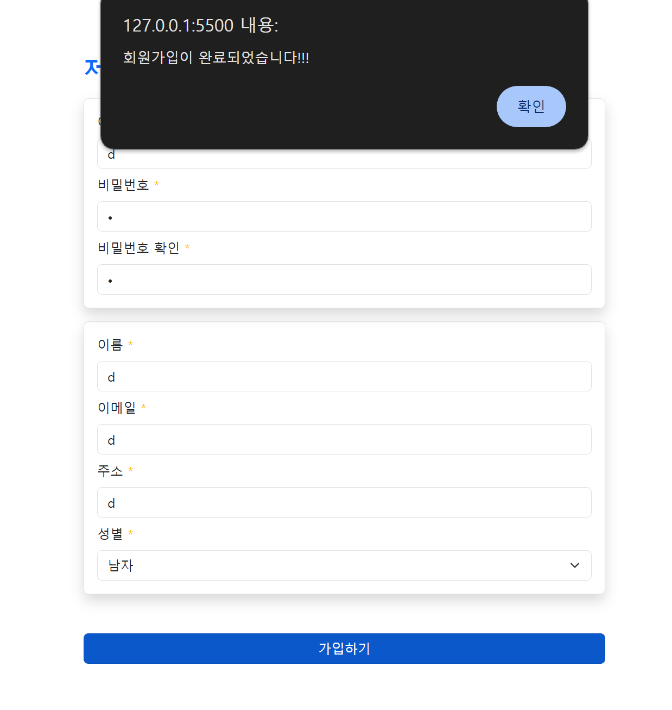
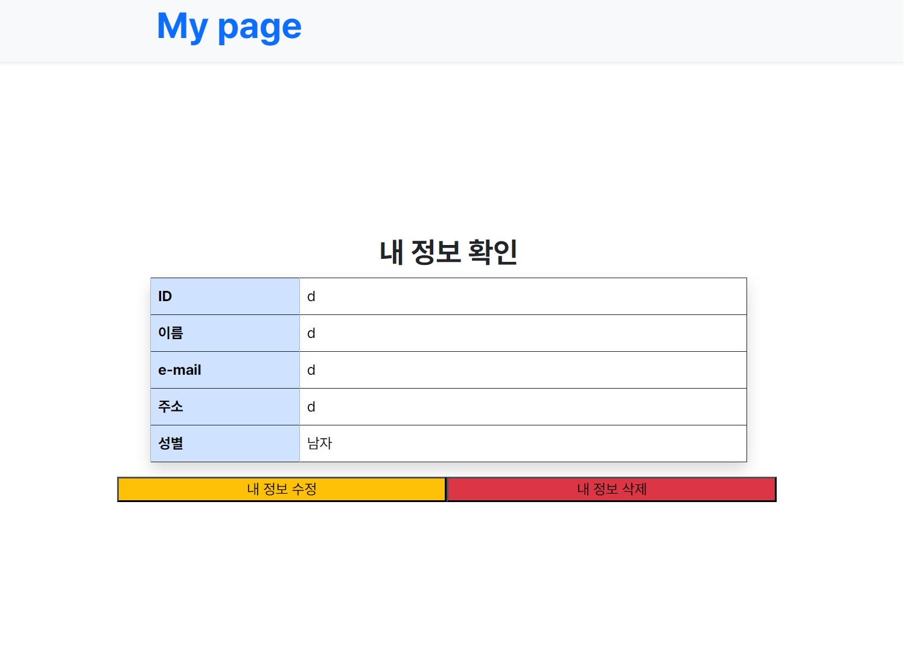
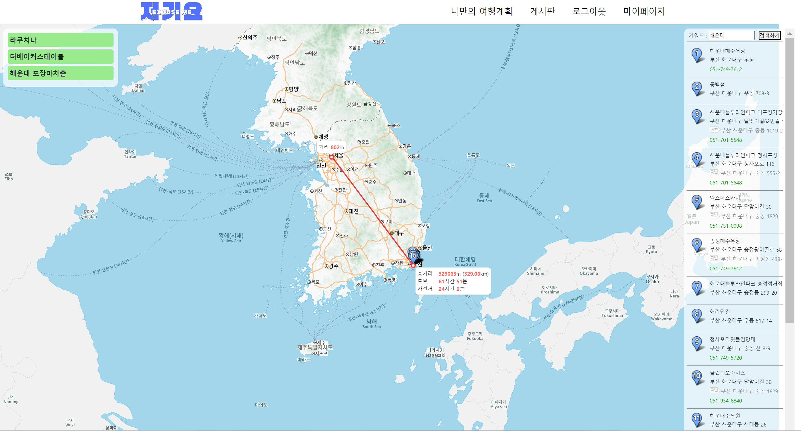
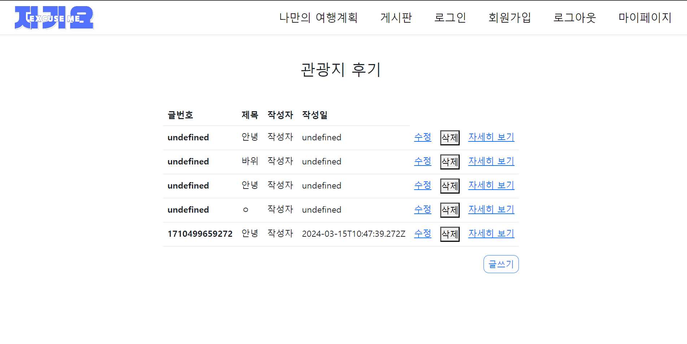
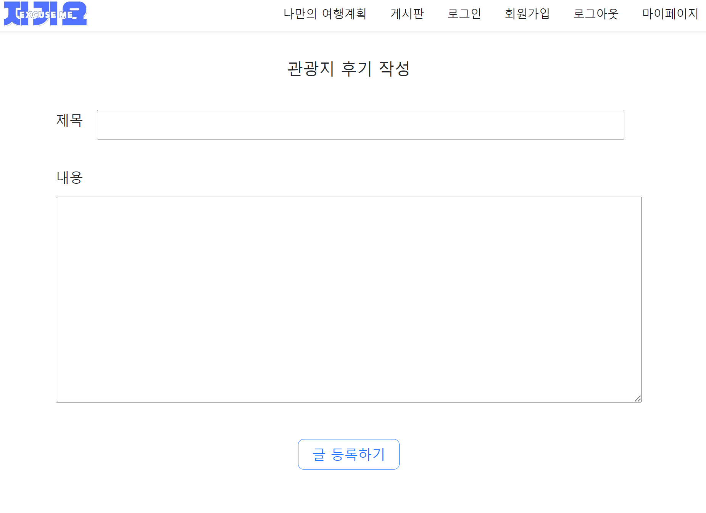
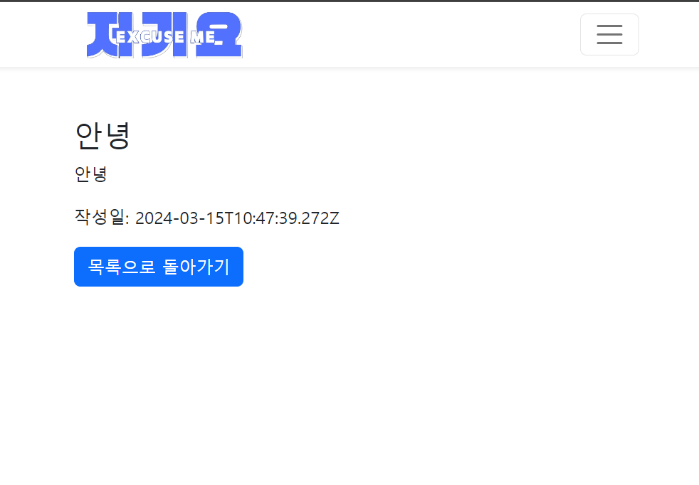

# 🏞 프로젝트 소개
- **🖥PJT명**: **Enjoy Trip Project**
- **🚶‍♂️단계**: **Web Front PJT**
- **📅진행일자**: **2024.03.15**
- **👩‍💻팀원:** **김민주, 박지훈, 신민경, 이지표**

- ## 프로젝트 설명
    - Web Front-End 기술인 HTML / CSS / JavaScript를 이해하고 활용할 수 있다.
    - Chart와 Bootstrap등 Library를 활용해, 더욱 향상된 디자인 및 기능을 구현한다.
    -  이미지, Map, Form등을 활용해, 사용자의 입장에서 편리하고, 멋진 디자인을 설계해 본다

# ⚙기본 기능

- ## ✔ 기본 기능
    - 메인 페이지 및 메뉴 구성
    - 관광지 정보 조회
    - 회원관리 페이지 (회원정보 등록, 수정, 삭제, 조회 화면)
    - 로그인 / 로그아웃페이지

# 🧱추가 기능

- ## ✔ 추가 기능
  - 추가 사이트맵 / 전체적인 메뉴 구성 화면
  - 나만의 여행계획 페이지

# 💪심화 기능

- ## ✔ 심화 기능
    - 심화 HotPlace 관련 페이지
    - 게시판 페이지

